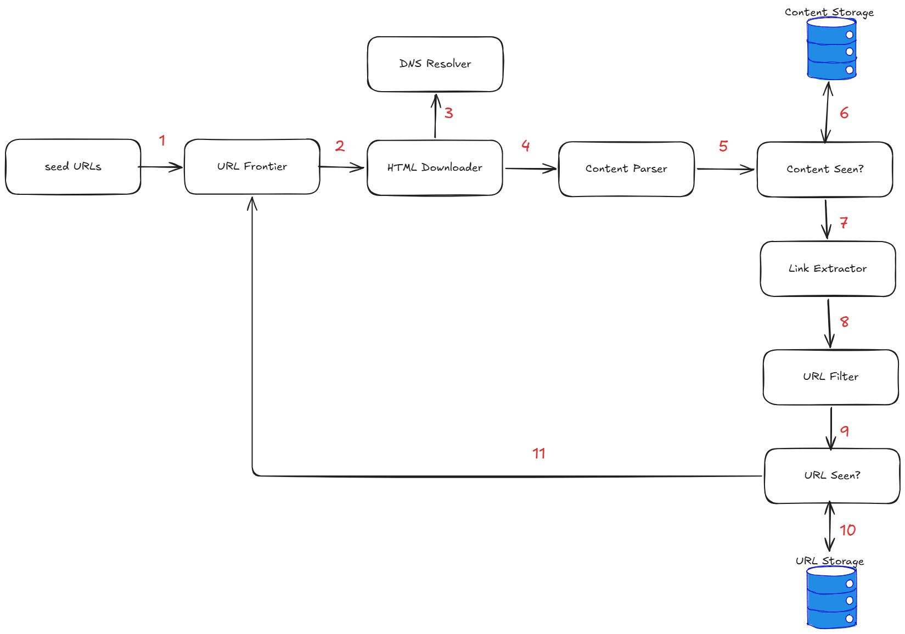

[](https://codecov.io/gh/s091648/scrape-and-analyze)

# Scrape & Analyze

A web scraping and AI-powered article analysis platform. Articles are automatically discovered from RSS feeds, blogs, and ArXiv, analyzed by LLMs to extract insights and tags, then served through a web UI for browsing, exploration, and RAG-powered Q&A.

## Concept
[](https://www.notion.so/sweetfatotaku/Chapter-9-Deisgn-a-Web-Crawler-3176d4fc5ccf8114aa4cceb952db9fca?source=copy_link)

The overall design is greatly inspired by the Chapter 9 of System Design Interview by Alex Xu.

As we're not trying to crawl every content possible across the whole world-wide web but just request contents from particular sources, the complexity of analyzing the structure and building a tree for the web pages are avoided, and we primarily uses provided API's and RSS feed if provided for article sources.

However, useful concepts such as host maps, queues, and politeness are taken into consideration.

## Architecture

```
┌──────────────────────────────────────────────┐
│            Frontend  (Next.js 16)            │
│  Article browse · Knowledge graph · Chat     │
│  NextAuth v4 · Tailwind · Shadcn/UI          │
│  Port 3000                                   │
└──────────────┬────────────────┬──────────────┘
               │ /api/proxy/**  │
┌──────────────▼──────────────┐ │
│    Backend API  (FastAPI)   │ │
│  /articles · /graph · /tags │ │
│  require_any_token / guest   │ │
│  token guard · structlog     │ │
│  Port 8000                  │ │
└──────────────┬───────────────┘ │
               │ SQLAlchemy ORM  │ /chat/completions (proxied)
┌──────────────▼───────────────┐ │
│         PostgreSQL           │◄┘
│  articles · analysis · tags  │
│  llm_providers · users · ... │
└──────────────┬────────────────────────────────┐
               │ SQLAlchemy ORM (same DB)         │
┌──────────────▼───────────────┐  ┌──────────────▼──────────────┐
│    Scraper / Analyzer (src/) │  │   chatbot-plugin (submodule) │
│  Scheduled job — RSS / blog / │  │  OpenAI-compatible RAG chat  │
│  ArXiv discovery, LLM chain   │  │  service; pgvector retrieval, │
│  analysis, weekly reports     │  │  tool-calling agent loop      │
└────────────────────────────────┘  Port 8001 (dev)               │
                                     └───────────────────────────────┘
```

## Services

| Directory | Role | Tech |
|-----------|------|------|
| [`frontend/`](./frontend/) | Web UI | Next.js 16, React 19, TypeScript, Tailwind CSS v4 |
| [`backend/`](./backend/) | REST API | FastAPI, Python 3.11, python-jose (JWT) |
| [`src/`](./src/) | Scraper & analyzer | Python 3.11, SQLAlchemy, BeautifulSoup, PyMuPDF |
| [`chatbot-plugin/`](./chatbot-plugin/) | RAG chat microservice (git submodule) | FastAPI, pgvector, Claude/Gemini/OpenRouter tool-calling |
| [`models/`](./models/) | Shared SQLAlchemy ORM models | Used by both `backend/` and `src/` against the same DB |
| [`shared/`](./shared/) | Cross-service Python package (enums, LLM/metric-provider loaders, GeoIP) | Imported by both `backend/` and `src/` |

## Data Flow

1. **Configure** — Admin adds scraper sources (RSS URL, blog CSS selectors, ArXiv/OpenAlex/Semantic Scholar keywords) via the web UI
2. **Scrape** — The `src/` service runs on a schedule, dispatches concurrent workers per source type, deduplicates by URL hash
3. **Analyze** — Each article is sent through a DB-driven LLM provider chain (`llm_providers` table, priority-ordered, rate-limited per provider) to extract tags, pain points, and insights; results are auto-translated for configured languages
4. **Store** — Results land in PostgreSQL; a weekly job also synthesizes per-topic weekly reports
5. **Browse** — Frontend fetches paginated articles from the FastAPI backend (guest visitors get a short-lived guest token automatically, no login required); users can filter by source, tag, and date, explore tag relationships in the knowledge graph, or ask questions via the RAG chatbot (proxied through `backend`'s `/chat/completions` to `chatbot-plugin`)

## Stack

| Layer | Technology |
|-------|-----------|
| Frontend | Next.js 16, React 19, Tailwind CSS v4, Shadcn/UI, Zustand |
| Backend API | FastAPI, Uvicorn, python-jose, bcrypt, Redis (rate limiting / view counts) |
| Scraper | Python 3.11, BeautifulSoup4, feedparser, PyMuPDF, httpx |
| RAG Chat | `chatbot-plugin` (FastAPI, pgvector), OpenAI-compatible `/v1/chat/completions`, tool-calling |
| LLM Providers | Google Gemini, Anthropic Claude, OpenRouter — DB-driven via the `llm_providers` table (`/admin/llm-providers`), not a config file |
| Database | PostgreSQL 15 + pgvector, SQLAlchemy 2.0, Alembic |
| Auth | NextAuth v4 (JWT + cookies), optional Google OAuth2, transparent guest-token bootstrap for anonymous visitors |
| Observability | structlog, Sentry (backend + frontend), Grafana Loki, OpenTelemetry (OTLP traces) |
| Deployment | Docker Compose (local), Railway (staging on PR, production on version tag) |
| Testing | pytest (unit + integration), Vitest, Playwright |

## Local Development

```bash
# Start all services (postgres, redis, pgadmin, backend, frontend, fastembed, chatbot_plugin)
docker compose up

# Run database migrations
make migrate

# Tests (all run in Docker — see each service's Makefile targets)
make test-src               # scraper/analyzer unit tests
make test-backend           # backend API unit tests
make test-backend-integration
make test-frontend          # Vitest unit tests
make test-frontend-e2e      # Playwright E2E
make test-all               # everything, with a summary
```

See [`backend/README.md`](./backend/README.md) and [`frontend/README.md`](./frontend/README.md) for service-level detail, and [`CLAUDE.md`](./CLAUDE.md) / `site/` (VitePress docs) for architecture deep-dives.
