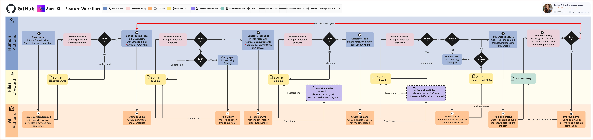

# Speckit SDD 開發流程指南

[Speckit](https://github.com/github/spec-kit) 是一套以 **Specification-Driven Development（SDD）** 為核心的 AI 輔助開發工具鏈。本專案透過 Claude Code 的 Speckit Skills 將設計文件、計畫、任務列表、實作驗證整合成一致的工作流程，確保每個功能都從清晰的規格出發。

## 工作流程總覽

下圖說明 SDD 完整的生命週期，從功能想法到程式碼落地：



> 圖片來源：[spec-kit/issues/467](https://github.com/github/spec-kit/issues/467)

整個流程分為兩個大階段：

| 階段 | 目的 | 對應 Skill |
|---|---|---|
| **設計階段** | 定義「要做什麼」 | `speckit-specify` → `speckit-plan` → `speckit-tasks` |
| **實作階段** | 執行「怎麼做」 | `speckit-implement` → `speckit-verify` |

---

## 開發全新功能

### 步驟一：撰寫功能規格（Spec）

```
/speckit-specify
```

提供自然語言描述，Skill 會引導你回答關鍵問題（背景、目標、邊界條件），並產生 `specs/<NNN>-<feature>/spec.md`，內容包含：

- **為什麼**要做這個功能（動機）
- **使用者故事**或情境
- **功能邊界**（in scope / out of scope）
- **成功指標**

### 步驟二：產生實作計畫（Plan）

```
/speckit-plan
```

根據 `spec.md` 產生 `plan.md`，包含：

- 架構決策（ADR）
- 資料模型（Data Model）
- 介面合約（Contract）
- 分層設計（Hexagonal / DDD）
- 預期的程式碼路徑

### 步驟三：分解任務（Tasks）

```
/speckit-tasks
```

將 `plan.md` 轉換成 `tasks.md`，每個任務：

- 依相依性排序（底層先行）
- 包含明確的完成條件
- 標示需撰寫的測試

### 步驟四：執行實作（Implement）

```
/speckit-implement
```

逐一執行 `tasks.md` 中的任務，遵循 TDD 流程（紅→綠→重構）。完成的任務會即時標記。

### 步驟五：驗證變更（Verify）

```
/speckit-verify-change
```

確認實作是否符合 `spec.md` 與 `plan.md` 的設計意圖，並檢查測試覆蓋率。

---

## 對既有功能補齊 Spec

當程式碼已存在，但設計文件不完整（無 spec / plan / tasks）時，使用探索流程由下而上補齊。

### 步驟一：探索現有實作

```
/openspec-explore
```

掃描現有程式碼，歸納目前的行為、資料流、介面，作為補 spec 的基礎材料。

### 步驟二：補充或更新規格

```
/openspec-apply-change
```

對照探索結果，補寫或修正 `spec.md` 中缺漏的部分（例如新增的邊界條件、已改變的資料模型）。

### 步驟三：同步其他 artifacts

```
/openspec-sync-specs
```

確保 `spec.md`、`plan.md`、`tasks.md`、contracts、data-model 等文件彼此一致，消除過時描述。

### 步驟四：歸檔已完成的變更

```
/openspec-archive-change
```

將已驗證的變更記錄歸檔，保留設計決策的歷史。

---

## 快速參考

| Skill | 用途 |
|---|---|
| `/speckit-specify` | 從自然語言建立新功能規格 |
| `/speckit-plan` | 從規格產生實作計畫 |
| `/speckit-tasks` | 將計畫分解成可執行任務 |
| `/speckit-implement` | 執行任務並持續標記進度 |
| `/speckit-verify-change` | 驗證實作符合規格 |
| `/speckit-analyze` | 對現有 artifacts 做一致性分析 |
| `/openspec-explore` | 探索既有程式碼以補齊規格 |
| `/openspec-apply-change` | 套用規格變更 |
| `/openspec-sync-specs` | 同步所有 SDD 文件 |
| `/openspec-archive-change` | 歸檔已完成變更 |

---

## 目錄結構慣例

每個功能的規格文件存放在 `specs/<NNN>-<feature>/`：

```
specs/
  001-article-collection/
    spec.md          ← 功能規格（Why & What）
    plan.md          ← 實作計畫（How）
    data-model.md    ← 資料模型
    tasks.md         ← 任務列表
    research.md      ← 研究筆記（選用）
    checklists/
      requirements.md  ← 需求確認清單
    contracts/
      *.md           ← 介面合約
```

規格文件是**設計的單一事實來源**，程式碼應與其保持一致，而非相反。
