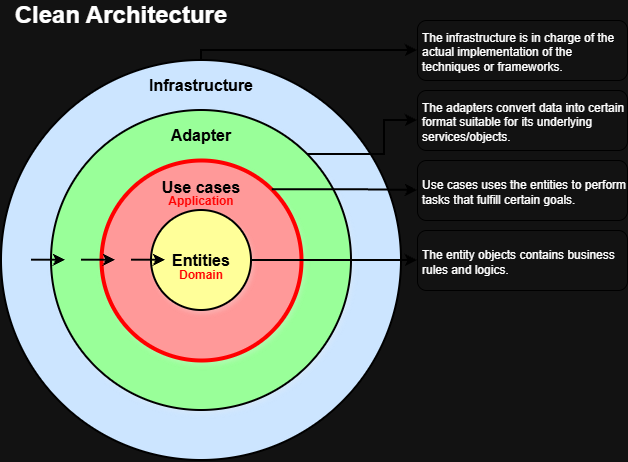

[](https://codecov.io/gh/s091648/scrape-and-analyze?flag=unit)
[](https://codecov.io/gh/s091648/scrape-and-analyze?flag=integration)


# Scraper / Analyzer Service

Standalone Python service that discovers articles, fetches content, analyzes them with LLM providers, and normalizes tags with embeddings. Runs on a schedule (cron or Railway job) and writes results directly to the shared PostgreSQL database.

## Architecture

Follows **Hexagonal Architecture / Domain-Driven Design**. Dependencies point inward: Infrastructure → Application → Domain.



```
src/
├── bootstrap.py                    # Dependency assembly (replaces composition_root.py)
├── config/
│   └── settings.py                 # App config: SENTRY_DSN, TRANSLATION_LANGUAGES, etc.
├── entrypoints/
│   └── cli/
│       ├── main.py                 # Process lifecycle: logging, OTel, Sentry, signals, jitter
│       └── translate.py            # Standalone translation entrypoint
├── modules/                        # Domain-Driven Design bounded contexts
│   ├── collection/                 # Article discovery & ingestion
│   │   ├── domain/                 # Entities: ScrapeJob, ArxivMetadata, ScraperSetting
│   │   │   ├── entities/           #   Value objects: ScrapedArticle, ScraperKeyword, URL
│   │   │   ├── repositories/       #   Interfaces: IScraperSettingRepository, IArxivMetadataRepository
│   │   │   └── services/           #   DedupService, Scraper (abstract)
│   │   └── application/
│   │       ├── use_cases/          #   ProcessScrapedArticleUseCase, PipelineStats
│   │       ├── event_handlers/     #   ArticleScrapedHandler
│   │       └── events/             #   ArticleScrapedEvent, PipelineCompletedEvent
│   ├── intelligence/               # LLM analysis, translation, tag normalization
│   │   ├── domain/                 # Entities: Analysis, AnalysesContent, TagNormalizationSuggestion
│   │   │   ├── repositories/       #   Interfaces for analysis, tags, translations
│   │   │   └── services/           #   ILLMService, IEmbeddingService
│   │   └── application/
│   │       ├── use_cases/          #   AnalyzeArticleUseCase, TranslateArticleUseCase,
│   │       │                       #   TranslateTagsUseCase, NormalizeTagsUseCase
│   │       ├── event_handlers/     #   ArticleProcessedHandler, AnalysisCompletedHandler,
│   │       │                       #   TagNormalizationHandler, FailedTaskPersistenceHandler
│   │       └── events/             #   AnalysisCompletedEvent, TagNormalizationCompletedEvent, etc.
│   └── shared/                     # Cross-module domain objects
│       └── domain/
│           └── entities/           #   Article, Topic
├── shared/                         # Cross-cutting application concerns
│   ├── domain/
│   │   ├── entities/               #   Article, Topic (root aggregates)
│   │   └── repositories/           #   IArticleRepository, ITopicRepository, IFailedTaskRepository
│   ├── application/
│   │   ├── events/                 #   ArticleProcessedEvent, FailedEvent
│   │   └── ports/                  #   IEventBus
│   └── logging.py                  # structlog façade (get_logger)
└── infrastructure/                 # Technical implementations
    ├── collection/
    │   ├── scrapers/               #   RssScraper, BlogScraper, ArxivScraper,
    │   │                           #   OpenAlexScraper, SemanticScholarScraper
    │   │                           #   (all extend BaseScraper)
    │   ├── clients/                #   RssClient, ArxivClient,
    │   │                           #   OpenAlexClient, SemanticScholarClient
    │   ├── parsers/                #   HtmlParser, PdfParser, SanitizeService
    │   ├── executor/               #   ScrapeExecutor (5 workers, per-host semaphore,
    │   │                           #   robots.txt respect), DiscoverTask, FetchTask
    │   └── collection_pipeline.py  #   CollectionPipeline.run()
    ├── intelligence/
    │   ├── llm/
    │   │   ├── providers/          #   GeminiProvider, ClaudeProvider, OpenRouterProvider
    │   │   ├── embedding/          #   GeminiEmbeddingProvider
    │   │   ├── rate_limit/         #   SlidingWindowStrategy, NoOpStrategy
    │   │   └── resilient_llm_service.py  # Ordered fallback across providers
    │   └── prompt/
    │       └── prompt_factory.py   #   ConcretePromptFactory (analysis, translation, tag prompts)
    ├── persistence/
    │   ├── shared/                 #   SqlAlchemyArticleRepository, TopicRepository, FailedTaskRepository
    │   ├── collection/             #   SqlAlchemyScraperSettingRepository, ArxivMetadataRepository
    │   ├── intelligence/           #   SqlAlchemyAnalysisRepository, TagRepository,
    │   │                           #   TagGroupDefinitionRepository, translation repos
    │   └── database.py             #   init_db(), get_session() (NullPool for short-lived runs)
    └── shared/
        ├── events/                 #   InMemoryEventBus
        ├── http/                   #   HttpClient, rate_limiter, retry, proxy, user_agent
        ├── logging.py              #   configure_logging(), bind_correlation_id()
        ├── notifications/          #   NotificationService, TelegramNotifier
        └── observability/          #   OTel tracing, Loki log shipping, GeoIP
```

## Pipeline Event Flow

The pipeline is fully event-driven via `InMemoryEventBus`. `bootstrap.py` wires all subscriptions before `pipeline.run()` is called:

```
CollectionPipeline.run()
  │
  ├─ [per scraper source]
  │    ├─ ScrapeExecutor.discover()  →  List[ScrapeJob]
  │    ├─ pre-dedup (UrlHash filter)
  │    └─ ScrapeExecutor.fetch()     →  ScrapedArticle
  │         └─ publish ArticleScrapedEvent
  │
  ├─ ArticleScrapedHandler
  │    └─ ProcessScrapedArticleUseCase (dedup + save Article + ArxivMetadata)
  │         └─ publish ArticleProcessedEvent
  │
  ├─ ArticleProcessedHandler
  │    └─ AnalyzeArticleUseCase (LLM chain → tags + analysis + embeddings)
  │         └─ publish AnalysisCompletedEvent  (or AnalysisFailedEvent)
  │
  ├─ TagNormalizationHandler  (on AnalysisCompletedEvent)
  │    └─ NormalizeTagsUseCase (embedding similarity → TagNormalizationSuggestion)
  │         └─ publish TagNormalizationCompletedEvent  (or TagNormalizationFailedEvent)
  │
  ├─ AnalysisCompletedHandler  (on TagNormalizationCompletedEvent)
  │    └─ TranslateArticleUseCase + TranslateTagsUseCase
  │         (auto-triggers for configured TRANSLATION_LANGUAGES)
  │
  ├─ FailedTaskPersistenceHandler
  │    └─ saves FailedTask on AnalysisFailedEvent / TagNormalizationFailedEvent / TranslationFailedEvent
  │
  └─ [on PipelineCompletedEvent]
       ├─ OtelMetricsHandler  (push counters/histograms to Grafana Cloud)
       └─ NotificationHandler (Telegram summary)
```

All handlers are wrapped with OpenTelemetry span decorators (`with_span`, `with_span_deferred`, `with_article_pipeline_span`) so the full article lifecycle appears as a trace tree.

## Scrapers

| Scraper | Source | Discovery method |
|---|---|---|
| `RssScraper` | RSS/Atom feeds | `RssClient` — parses feed entries |
| `BlogScraper` | Blog URLs | CSS-selector crawl via `HtmlParser` |
| `ArxivScraper` | arXiv API | `ArxivClient` — keyword + category search |
| `OpenAlexScraper` | OpenAlex API | `OpenAlexClient` — keyword search, tracks `original_source` + `primary_topic` |
| `SemanticScholarScraper` | Semantic Scholar API | `SemanticScholarClient` — keyword search, tracks `original_source`, `paper_id` |

All scrapers extend `BaseScraper` and implement `discover() → List[ScrapeJob]` and `fetch(job) → ScrapedArticle`. The `ConcreteScraperFactory` selects the correct scraper based on `ScraperSetting.source_type`.

`ScrapeExecutor` runs concurrent fetches with 5 workers, a per-host semaphore, and respects `robots.txt` for blog sources.

## LLM Provider Configuration

Providers are loaded at startup from the **`llm_providers` database table** (managed via `/admin/llm-providers` in the frontend). Each row specifies name, model, `api_key_env`, priority, `is_active`, and rate limits (`rpm`/`tpm`/`rpd`).

`ResilientLLMService` holds an ordered list of `ProviderHandler` objects sorted by priority. On `analyze()`, it walks providers in priority order and falls back on `RateLimitExhausted` or any exception. `SlidingWindowStrategy` enforces per-window RPM/TPM/RPD limits.

`ResilientEmbeddingService` follows the same pattern for embedding providers (currently `GeminiEmbeddingProvider`). Embeddings (`vector(768)`) are stored on the `tags` table via pgvector and used by `NormalizeTagsUseCase` for tag deduplication suggestions.

## Process Lifecycle (`main.py`)

1. `validate_config()` — asserts required env vars are set
2. `configure_logging()` — structlog + Loki handler attach
3. **Startup jitter** — random 0–180 s sleep (skip with `RUN_IMMEDIATELY=1`)
4. `init_default_client()` — shared `HttpClient` with retry/proxy
5. `init_run_context()` — generates `run_id` + `correlation_id`; bound to every log entry
6. Signal handlers — SIGTERM/SIGINT set `_shutdown_requested` flag
7. **OTel root span** `scraper.run` wraps `build_collection_pipeline()` + `pipeline.run()`
8. On completion — logs per-source stats (new / duplicate / failed articles)
9. `shutdown_tracing()` — flushes `BatchSpanProcessor` after root span ends

Hard timeout: **50 minutes**.

## Observability

| Concern | Implementation |
|---|---|
| Traces | OpenTelemetry → Grafana Cloud (OTLP) |
| Logs | structlog → Grafana Loki (fire-and-forget POST) |
| Metrics | OTel counters/histograms pushed on `PipelineCompletedEvent` |
| Errors | Sentry SDK (optional, graceful no-op if `SENTRY_DSN` unset) |
| Geo | MaxMind GeoIP2 (`MAXMIND_LICENSE_KEY`) |

## Deployment

| Context | File |
|---|---|
| Production | `Dockerfile` (multi-stage, `uv` for dependency install) |
| Development | `Dockerfile.dev` (hot-reload) |
| Config | `railway.toml` (Railway cron job trigger) |

Required environment variables: `DATABASE_URL`, one or more LLM API keys (configured via `api_key_env` in `llm_providers` table), `TELEGRAM_BOT_TOKEN`, `SENTRY_DSN` (optional), `MAXMIND_LICENSE_KEY` (optional).
