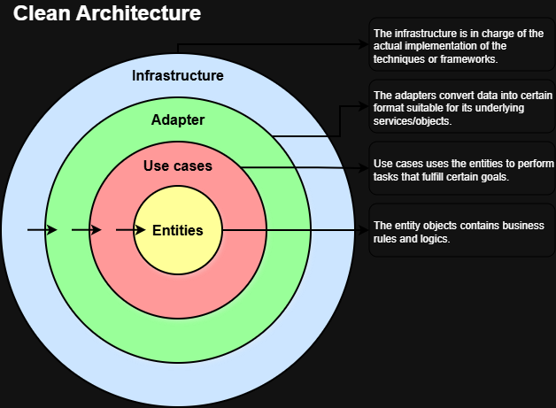

# Scraper / Analyzer Service

Standalone Python service that discovers articles, fetches content, and analyzes them with LLM providers. Runs on a schedule (cron or Railway job) and writes results directly to the shared PostgreSQL database.

## Architecture



```
src/
├── main.py                     # Entry point — dispatches scrape cycles by frequency
├── config.py                   # Loads scraper settings + LLM provider config from DB
├── database.py                 # SQLAlchemy session factory (NullPool for short-lived runs)
├── scrapers/
│   ├── scrapers/
│   │   ├── base_scraper.py     # Abstract scraper interface
│   │   ├── rss_scraper.py      # RSS/Atom feed reader
│   │   ├── blog_scraper.py     # CSS-selector-based blog crawler
│   │   └── arxiv_scraper.py    # ArXiv API client
│   ├── strategy/
│   │   └── scrape_dispatcher.py  # Thread-pool executor (3 workers) for parallel scraping
│   └── content_parsers/        # HTML and PDF text extraction (BeautifulSoup, PyMuPDF)
├── analyzers/
│   ├── provider_chain.py       # Composite pattern: ordered fallback across LLM providers
│   ├── providers/
│   │   ├── gemini.py           # Google Gemini API
│   │   ├── openrouter.py       # OpenRouter API
│   │   └── claude.py           # Anthropic Claude (optional)
│   └── strategies/
│       ├── leaky_bucket_strategy.py  # RPM / TPM / RPD rate limiting
│       └── no_op_strategy.py         # Disabled rate limiting
├── notifications/
│   ├── service.py              # Multi-channel notifier dispatcher
│   └── telegram.py             # Telegram bot integration
├── observability/
│   ├── metrics.py              # OpenTelemetry counters & histograms
│   ├── loki_logging.py         # Structured log shipping to Grafana Loki
│   ├── run_context.py          # Correlation IDs per scrape run
│   ├── run_summary.py          # Aggregated stats (articles scraped, analyzed, failed)
│   └── geoip.py                # MaxMind IP geolocation
└── utils/
    ├── logging.py              # structlog configuration
    └── sanitizer.py            # URL normalization + hashing for deduplication
```

## Data Flow

1. `main.py` queries `scraper_settings` for sources due to run based on configured frequency
2. `scrape_dispatcher.py` fans out to 3 worker threads — one per source
3. Each scraper fetches articles, and `content_parsers` extracts clean text from HTML or PDF
4. URL hash deduplication skips already-seen articles
5. `provider_chain.py` sends article content to the first available LLM (Gemini → OpenRouter)
6. Analysis result (tags, pain points, insights) is stored in `articles` + `analysis` tables
7. Metrics are pushed to OpenTelemetry; a summary notification is sent via Telegram

## LLM Provider Configuration

Providers are defined in `providers.toml` at the project root. Each entry specifies:
- API endpoint and model name
- Rate limits (requests per minute, tokens per minute, requests per day)
- Whether rate limiting is active (`leaky_bucket` vs `no_op` strategy)

The `provider_chain` tries providers in order and falls back on failure or rate-limit exhaustion.

## Deployment

| Context | File |
|---------|------|
| Production | `Dockerfile` (multi-stage, uses `uv` for dependency install) |
| Development | `Dockerfile.dev` (hot-reload) |
| Config | `railway.toml` (Railway cron job trigger) |

Environment variables required: `DATABASE_URL`, `GEMINI_API_KEY` / `OPENROUTER_API_KEY`, `TELEGRAM_BOT_TOKEN`, `SENTRY_DSN`.
